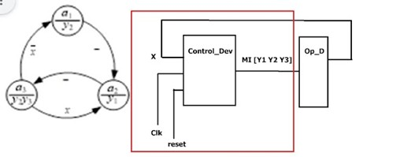
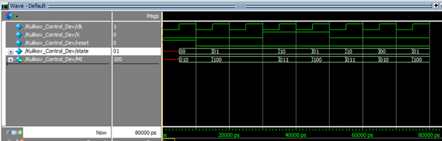

# Завдання 1

За заданим графом керуючого автомату (рис. 1) розробити алгоритм керування, для реалізації якого написати модуль Control_Dev. Структурна схема модуля керування зображена на рис. 2. Модуль генерує керуючу мікроінструкцію МІ[ Y1 Y2 Y3]  в кожному такті роботи модуля, яка поступає на операційний пристрій (ОП не треба розробляти). Для спрощення генерацію reset і clk можна розмістити всередині модуля Control_Dev. Виконати модулювання блоку керування в програмі ModelSim. Код програми разом зі скриншотом часової діаграми та коментарями прикріпити в класрум. В назві проєкту і назві модуля має бути прізвище студента. За вимогою викладача можуть бути перевірені оригінальні проєкти.   

<p align="center">
  <br>
</p>

## Код

```verilog
`timescale 1ns / 1ps

module Kulikov_Control_Dev(
    output reg [2:0] MI // MI[2]=Y1, MI[1]=Y2, MI[0]=Y3
);

    // Внутрішні сигнали для симуляції
    reg clk;
    reg reset;
    reg X;

    // Кодування станів (Binary)
    parameter a1 = 2'b00;
    parameter a2 = 2'b01;
    parameter a3 = 2'b10;

    reg [1:0] state, next_state;

    // Генерація тактового сигналу (Період 10нс)
    initial clk = 0;
    always #5 clk = ~clk;

    // Тестовий сценарій (Стимули)
    initial begin
        reset = 1;
        X = 0;
        #10 reset = 0; 

        // Перехід A1 -> A2 (Безумовний)
        #10; 
        // Перехід A2 -> A3 (Безумовний)
        #10; 
        
        // Перевірка умови: A3 -> A2 при X=1
        X = 1;
        #10; 
        
        // Повернення A2 -> A3
        #10; 
        
        // Перевірка умови: A3 -> A1 при X=0
        X = 0;
        #10; 
        
        #20;
        $finish; 
    end

    // Блок пам'яті стану (Синхронний)
    always @(posedge clk) begin
        if (reset)
            state <= a1;
        else
            state <= next_state;
    end

    // Логіка переходів (Комбінаційна)
    always @(*) begin
        case (state)
            a1: next_state = a2;
            a2: next_state = a3; // Безумовний перехід
            a3: if (X) next_state = a2; else next_state = a1;
            default: next_state = a1;
        endcase
    end

    // Логіка виходів (Автомат Мура)
    always @(state) begin
        case (state)
            a1: MI = 3'b010; // Y2 = 1
            a2: MI = 3'b100; // Y1 = 1
            a3: MI = 3'b011; // Y2, Y3 = 1
            default: MI = 3'b000;
        endcase
    end

endmodule
```

## Часова діаграма

<p align="center">
  <br>
</p>

---

# Завдання 2
1. Перевести номер студентського квитка (номер по списку в Кампусі) в двійкову систему числення (h16 ...h3, h2, h1)
2. Доповнити отримане двійкове число до 16 розрядів і сформувати два 8-розрядних аргументи R1 – із старшої частини числа, R2 – із молодшої частини числа. Старші розряди/старший розряд в отриманих аргументах – знакові/ий. Таким чином ми отримали дві мантиси зі знаками.
3. З отриманими аргументами виконати задану функцію, пояснити всі перетворення за допомогою цифрової діаграми стану регістрів (в графічному або табличному вигляді). 
   3.1. Пояснити формування ознак після виконання арифметичної операції додавання/віднімання для вирішення проблеми нормалізації, зробити висновок. Зробити перевірку в десятковому коді (можна цілочисельними еквівалентами).  3.1. Виконати логічний зсув та логічну операцію, після чого проаналізувати ознаку рівності результату нулю 

## Функції для обчислення:

| h1 h2 | Функція |
| :---: | :--- |
| 00 | F = (X2 + X1) & 2X1 |
| 01 | F = (X1 + X2) & 2X2 |
| **10** | **F = (X1 - X1) Ꚛ X1/2** |
| 11 | F = (X2 - X1) V X2/2 |

## Виконання:

**Варіант:** 4209 (десятковий). 
У двійковому коді: `100000 1110001`

Знайдемо останні біти ($h$): 
$h_7=1$, $h_6=1$, $h_5=1$, $h_4=0$, $h_3=0$, $h_2=0$, $h_1=1$

| h1 | h2 | Функція |
| :-: | :-: | :--- |
| 1 | 0 | **F = (X1 - X1) Ꚛ X1/2** |

Доповнюємо число до 16 розрядів:
`0001 0000 0111 0001`

Розбиваємо на два 8-бітові аргументи:
* **X1** = `00010000` 
* **X2** = `01110001` 

Обидва числа додатні (старший біт = 0).

### Операція: X1 - X1

```text
  00010000 (X1)
+ 11110000 (-X1)   
----------------
 100000000                 
(Одиниця, яка вийшла за межі 8-бітної сітки у результаті операції, відкидається)
```
У десятковій: 16 - 16 = 0

Ознаки після виконання операції:
ZF = 1 (результат дорівнює нулю), SF = 0 (знаковий біт), OF = 0 (переповнення відсутнє)

### Операція X1 / 2
Виконується за допомогою логічного зсуву вправо:
`00010000` (16)  >>  `00001000` (8)

### Фінальна логічна операція: XOR

```text
    00000000 (Результат додавання)
xor 00001000 (Результат зсуву)
-----------------------------
    00001000 (Фінальний результат)
```

Ознака результату:
Результат не дорівнює нулю, тому ZF = 0.